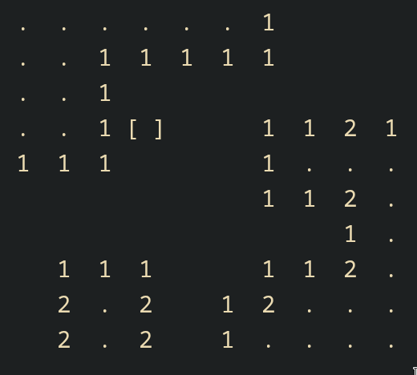
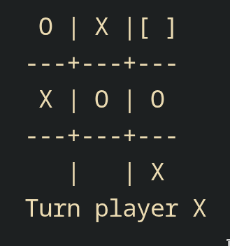
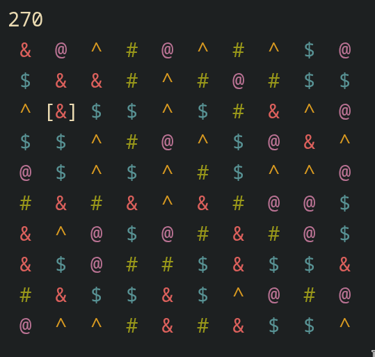
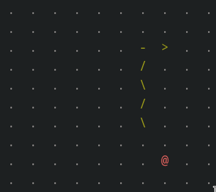

# Console Games Collection
A collection of simple terminal-based games implemented in pure C using only standard libraries.

## Available Games

### 1. Minesweeper



Classic minesweeper game with grid-based gameplay.
- Navigate with WASD keys
- Place flags with 'f' key
- Reveal cells with Spacebar
- Quit with 'q'

### 2. Tic Tac Toe



Two-player Tic Tac Toe game.
- Navigate with WASD keys
- Place X or O with Spacebar
- Quit with 'q'

### 3. Match-3 Puzzle



A simple match-3 puzzle game.
- Navigate with WASD keys
- Swap tiles with Spacebar + direction + Spacebar
- Quit with 'q'

### 4. Snake



Snake game.
- Navigate with WASD keys
- Quit with 'q'

### Compilation
```bash
make # Compile all games

clang -o bin/minesweeper src/minesweeper.c # Or compile specific game
```

```bash
./bin/<game>
```